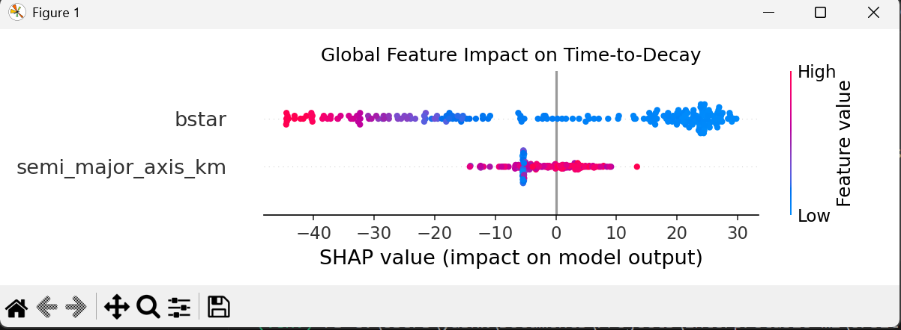
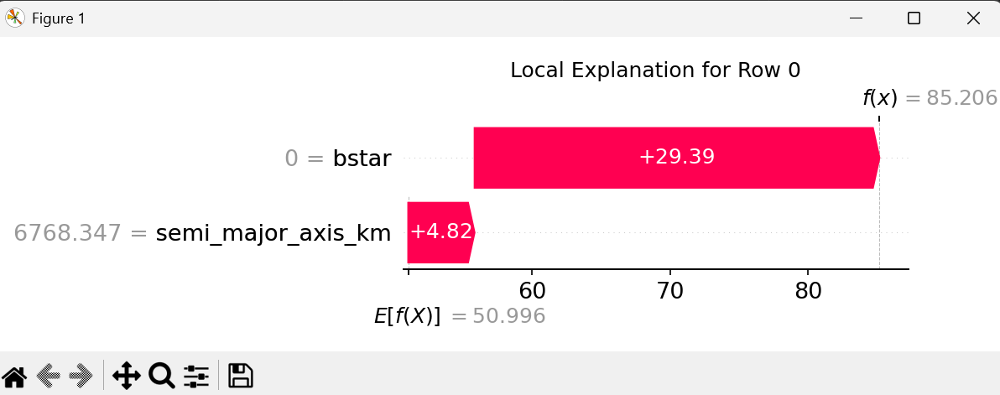

# Orbit Decay Modelling - Satellite Re-entry Prediction
  

## Overview
This is an end-to-end Machine Learning pipeline designed to predict the atmospheric re-entry dates of decaying satellites. 

Instead of relying solely on complex physics simulations, this project bridges **Astrodynamics** and **Data Science**. It ingests raw Two-Line Elements (TLEs), extracts physical features using Kepler's Third Law, and trains an ensemble Random Forest model to predict the "days to decay." Most importantly, the model's decisions are mathematically decoded using **SHAP (SHapley Additive exPlanations)** to ensure trust and transparency.

---

## 🚀 The Physics to ML Pipeline

1. **Data Ingestion:** Parsed historical TLE data from verified public archives (e.g., the Tiangong-1 decay event).
2. **Feature Engineering:** Extracted raw string data and converted it into physical features:
   - **Semi-Major Axis (a):** Calculated via Kepler's math to represent altitude.
   - **B* Drag Term:** Represents atmospheric friction and the satellite's ballistic coefficient.
3. **Supervised Learning:** Calculated the exact time differential between the TLE epoch and the historical crash date to create the target variable (Y).
4. **Modeling:** Trained a `RandomForestRegressor` to capture the highly non-linear, exponential "cliff" of orbital decay.

<details>
<summary><b>Click to view the core Keplerian Feature Extractor</b></summary>

```python
def parse_tle(name, line1, line2):
    """Converts raw TLE strings into physical features."""
    ts = load.timescale()
    satellite = EarthSatellite(line1, line2, name, ts)
    
    # Extract Mean Motion and compute Semi-Major Axis
    mean_motion_revs_per_day = satellite.model.no_kozai * (24 * 60) / (2 * np.pi)
    mu = 398600.44  # Earth's gravitational parameter
    n_rad_per_sec = mean_motion_revs_per_day * (2 * np.pi) / 86400
    semi_major_axis = (mu / (n_rad_per_sec ** 2)) ** (1/3)
    
    return {
        "semi_major_axis_km": semi_major_axis,
        "bstar": satellite.model.bstar
    }
</details>

## Results & Explainable AI (XAI)
Aerospace models cannot be "black boxes." A Random Forest was chosen not only for its robustness to noisy radar data but because it allows for full mathematical transparency.

**Baseline Performance:** The model achieved a Mean Absolute Error (MAE) of ~7 days on a 100-day decay trajectory, successfully learning the exponential drag curve without explicitly being programmed with atmospheric density models.

### Global Interpretability
The SHAP Summary plot proves the model learned the laws of physics. It correctly identified that high atmospheric drag (B*) is the strongest predictor of an immediate re-entry.



### Local Interpretability
For any specific prediction, the model provides a mathematical receipt. The Waterfall plot below demonstrates how the model arrived at an 85-day prediction by applying bonuses and penalties based on the satellite's specific altitude and drag readings at that exact moment.



---

## Repository Structure

```text
orbit decay modelling/
├── assets/                 # SHAP visualizations and plots
├── data/                   # Raw TLE dumps and processed CSVs
├── src/                    # Python pipeline scripts
│   ├── data_prep.py        # Keplerian math and TLE parsing
│   ├── load_real_data.py   # Ingestion of local TLE archives
│   ├── train_model.py      # Random Forest training and SHAP evaluation
├── requirements.txt        # Project dependencies
└── README.md               # Project documentation
```

---

## 🛠️ How to Run Locally

1. **Clone the repository:**
   ```bash
   git clone [https://github.com/yourusername/orbital-guardian.git](https://github.com/yourusername/orbital-guardian.git)
   cd orbital-guardian
   ```
2. **Install dependencies:**
   ```bash
   pip install -r requirements.txt
   ```
3. **Run the data pipeline:**
   ```bash
   python src/load_real_data.py
   ```
4. **Train the model and generate SHAP plots:**
   ```bash
   python src/train_model.py
   ```
